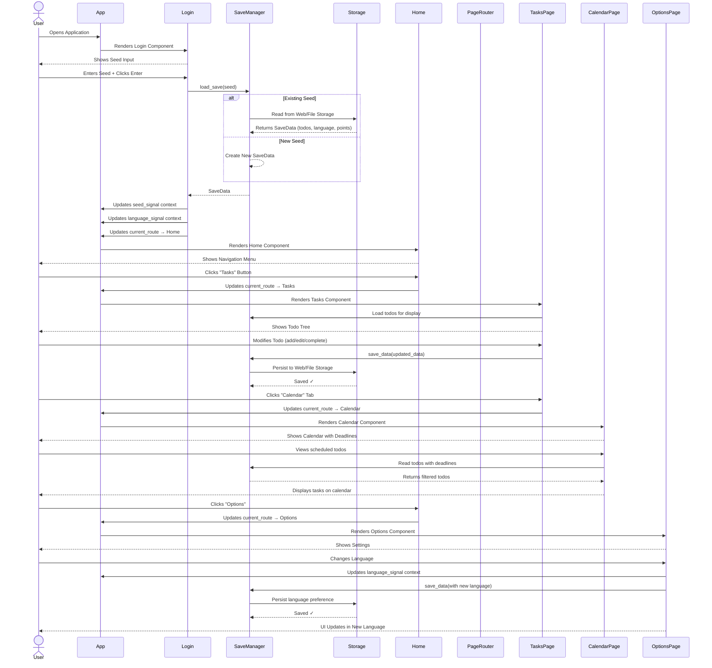

```mermaid
sequenceDiagram
    actor User
    participant App
    participant Login
    participant SaveManager
    participant Storage
    participant Home
    participant PageRouter
    participant TasksPage
    participant CalendarPage
    participant OptionsPage

    User->>App: Opens Application
    App->>Login: Renders Login Component
    Login-->>User: Shows Seed Input

    User->>Login: Enters Seed + Clicks Enter
    Login->>SaveManager: load_save(seed)
    
    alt Existing Seed
        SaveManager->>Storage: Read from Web/File Storage
        Storage-->>SaveManager: Returns SaveData (todos, language, points)
    else New Seed
        SaveManager-->>SaveManager: Create New SaveData
    end
    
    SaveManager-->>Login: SaveData
    Login->>App: Updates seed_signal context
    Login->>App: Updates language_signal context
    Login->>App: Updates current_route → Home
    
    App->>Home: Renders Home Component
    Home-->>User: Shows Navigation Menu

    User->>Home: Clicks "Tasks" Button
    Home->>App: Updates current_route → Tasks
    App->>TasksPage: Renders Tasks Component
    TasksPage->>SaveManager: Load todos for display
    TasksPage-->>User: Shows Todo Tree

    User->>TasksPage: Modifies Todo (add/edit/complete)
    TasksPage->>SaveManager: save_data(updated_data)
    SaveManager->>Storage: Persist to Web/File Storage
    Storage-->>SaveManager: Saved ✓

    User->>TasksPage: Clicks "Calendar" Tab
    TasksPage->>App: Updates current_route → Calendar
    App->>CalendarPage: Renders Calendar Component
    CalendarPage-->>User: Shows Calendar with Deadlines

    User->>CalendarPage: Views scheduled todos
    CalendarPage->>SaveManager: Read todos with deadlines
    SaveManager-->>CalendarPage: Returns filtered todos
    CalendarPage-->>User: Displays tasks on calendar

    User->>Home: Clicks "Options"
    Home->>App: Updates current_route → Options
    App->>OptionsPage: Renders Options Component
    OptionsPage-->>User: Shows Settings

    User->>OptionsPage: Changes Language
    OptionsPage->>App: Updates language_signal context
    OptionsPage->>SaveManager: save_data(with new language)
    SaveManager->>Storage: Persist language preference
    Storage-->>SaveManager: Saved ✓
    OptionsPage-->>User: UI Updates in New Language
```
