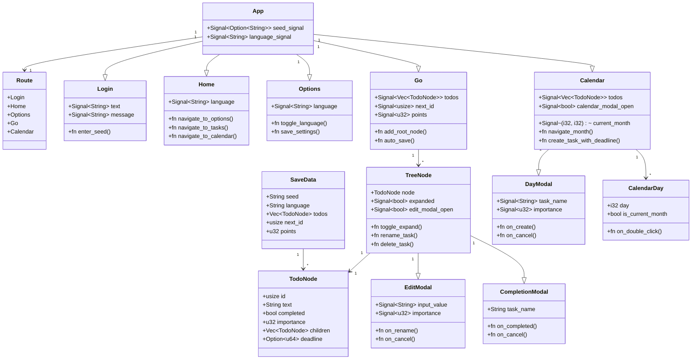

```mermaid
classDiagram
    class SaveData {
        +String seed
        +String language
        +Vec~TodoNode~ todos
        +usize next_id
        +u32 points
    }

    class TodoNode {
        +usize id
        +String text
        +bool completed
        +u32 importance
        +Vec~TodoNode~ children
        +Option~u64~ deadline
    }

    class Route {
        +Login
        +Home
        +Options
        +Go
        +Calendar
    }

    class App {
        +Signal~Option~String~~ seed_signal
        +Signal~String~ language_signal
    }

    class Login {
        +Signal~String~ text
        +Signal~String~ message
        +fn enter_seed()
    }

    class Home {
        +Signal~String~ language
        +fn navigate_to_options()
        +fn navigate_to_tasks()
        +fn navigate_to_calendar()
    }

    class Options {
        +Signal~String~ language
        +fn toggle_language()
        +fn save_settings()
    }

    class Go {
        +Signal~Vec~TodoNode~~ todos
        +Signal~usize~ next_id
        +Signal~u32~ points
        +fn add_root_node()
        +fn auto_save()
    }

    class TreeNode {
        +TodoNode node
        +Signal~bool~ expanded
        +Signal~bool~ edit_modal_open
        +fn toggle_expand()
        +fn rename_task()
        +fn delete_task()
    }

    class EditModal {
        +Signal~String~ input_value
        +Signal~u32~ importance
        +fn on_rename()
        +fn on_cancel()
    }

    class CompletionModal {
        +String task_name
        +fn on_completed()
        +fn on_cancel()
    }

    class Calendar {
        +Signal~(i32, i32)~ current_month
        +Signal~Vec~TodoNode~~ todos
        +Signal~bool~ calendar_modal_open
        +fn navigate_month()
        +fn create_task_with_deadline()
    }

    class DayModal {
        +Signal~String~ task_name
        +Signal~u32~ importance
        +fn on_create()
        +fn on_cancel()
    }

    class CalendarDay {
        +i32 day
        +bool is_current_month
        +fn on_double_click()
    }

    SaveData "1" --> "*" TodoNode
    Go "1" --> "*" TreeNode
    TreeNode "1" --> "1" TodoNode
    TreeNode "1" --|> EditModal
    TreeNode "1" --|> CompletionModal
    Calendar "1" --|> DayModal
    Calendar "1" --> "*" CalendarDay
    App "1" --> "1" Route
    App "1" --|> Login
    App "1" --|> Home
    App "1" --|> Options
    App "1" --|> Go
    App "1" --|> Calendar
```
