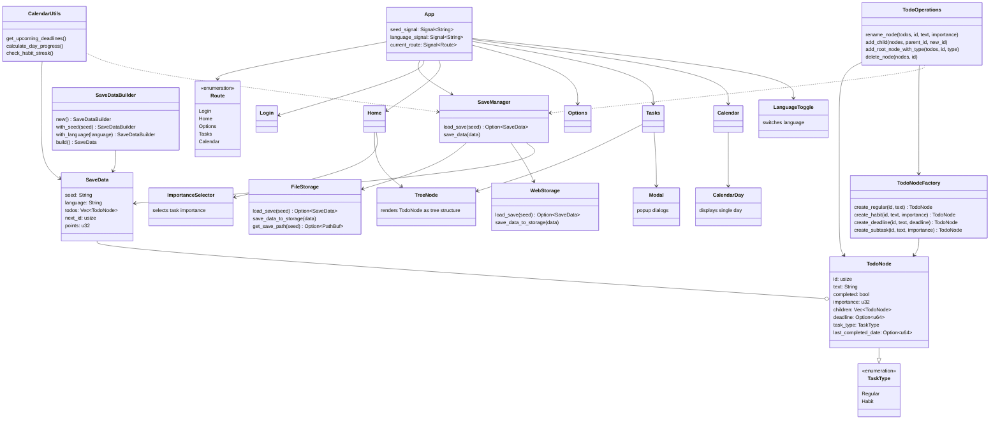

```mermaid
classDiagram
    %% Domain Models Layer
    class TaskType {
        <<enumeration>>
        Regular
        Habit
    }

    class TodoNode {
        id: usize
        text: String
        completed: bool
        importance: u32
        children: Vec~TodoNode~
        deadline: Option~u64~
        task_type: TaskType
        last_completed_date: Option~u64~
    }

    class SaveData {
        seed: String
        language: String
        todos: Vec~TodoNode~
        next_id: usize
        points: u32
    }

    class Route {
        <<enumeration>>
        Login
        Home
        Options
        Tasks
        Calendar
    }

    %% Business Logic Layer
    class TodoNodeFactory {
        create_regular(id, text) TodoNode
        create_habit(id, text, importance) TodoNode
        create_deadline(id, text, deadline) TodoNode
        create_subtask(id, text, importance) TodoNode
    }

    class TodoOperations {
        rename_node(todos, id, text, importance)
        add_child(nodes, parent_id, new_id)
        add_root_node_with_type(todos, id, type)
        delete_node(nodes, id)
    }

    class CalendarUtils {
        get_upcoming_deadlines()
        calculate_day_progress()
        check_habit_streak()
    }

    class SaveDataBuilder {
        new() SaveDataBuilder
        with_seed(seed) SaveDataBuilder
        with_language(language) SaveDataBuilder
        build() SaveData
    }

    %% Data Access Layer
    class SaveManager {
        load_save(seed) Option~SaveData~
        save_data(data)
    }

    class FileStorage {
        load_save(seed) Option~SaveData~
        save_data_to_storage(data)
        get_save_path(seed) Option~PathBuf~
    }

    class WebStorage {
        load_save(seed) Option~SaveData~
        save_data_to_storage(data)
    }

    %% Presentation Layer
    class App {
        seed_signal: Signal~String~
        language_signal: Signal~String~
        current_route: Signal~Route~
    }

    class Login
    class Home
    class Options
    class Tasks
    class Calendar

    class TreeNode {
        renders TodoNode as tree structure
    }

    class CalendarDay {
        displays single day
    }

    class Modal {
        popup dialogs
    }

    class ImportanceSelector {
        selects task importance
    }

    class LanguageToggle {
        switches language
    }

    %% Relationships
    TodoNode --|> TaskType
    SaveData --o TodoNode
    App --> Route
    App --> SaveManager
    
    TodoNodeFactory --> TodoNode
    TodoOperations --> TodoNode
    TodoOperations --> TodoNodeFactory
    
    CalendarUtils --> SaveData
    SaveDataBuilder --> SaveData
    
    SaveManager --> FileStorage
    SaveManager --> WebStorage
    SaveManager --> SaveData
    
    App --> Login
    App --> Home
    App --> Options
    App --> Tasks
    App --> Calendar
    
    Home --> TreeNode
    Tasks --> TreeNode
    Home --> ImportanceSelector
    Tasks --> Modal
    Calendar --> CalendarDay
    App --> LanguageToggle
    
    TodoOperations ..> SaveManager
    CalendarUtils ..> SaveManager
```
